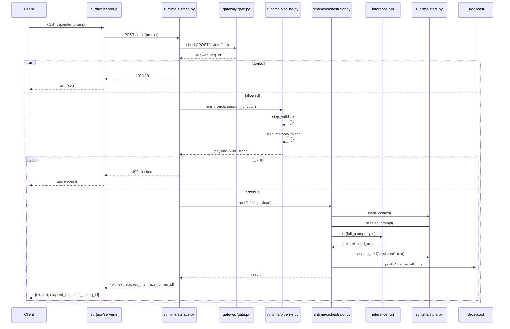

# Architecture
Toggle between four views of the same architecture. Each lens highlights what matters for that perspective.

---

## Interactive architecture map

=== ":systems: Systems"

    How the major components connect, boot order, and data flow between runtime, workspace, CLI, and external surfaces.

    ```mermaid
    flowchart TD
        classDef node fill:#333,stroke:#222,color:#fff
        classDef data fill:#f0f0f0,stroke:#ddd,color:#222

        subgraph Boot
            B1[1. pnpm install] --> B2[2. config load]
            B2 --> B3[3. Python runtime init]
            B2 --> B4[4. Node.js bridge init]
            B2 --> B5[5. workspace init]
            B2 --> B6[6. dashboard build]
            B2 --> B7[7. surfaces deploy]
        end

        subgraph RuntimeCore
            R0[main.py] --> R1[runtime/]
            R1 --> R2[FastAPI uvicorn]
            R2 --> R3[/health]
            R2 --> R4[/infer]
            R2 --> R5[/infer/stream]
            R2 --> R6[/memory]
            R2 --> R7[/state]
            R2 --> R8[/ws]
            R1 --> R9[gateway/gate]
            R9 --> R10[pipeline]
            R10 --> R11[orchestrator]
            R11 --> R12[inference engine]
        end

        subgraph SurfaceBridge
            S1[surface/server.js] --> S2[Node.js HTTP]
            S2 --> S3[/daily/]
            S2 --> S4[/canvas/]
            S2 --> S5[/studio/]
            S2 --> S6[proxy /api/*]
            S2 --> S7[WS relay]
        end

        subgraph Data
            D1[state.json] --> R4
            D2[memory.json] --> R6
            D3[models/] --> R12
        end

        subgraph Operator
            O1[Ops Workspace] --> O2[Vite 5173]
            O2 --> S2
        end

        subgraph CLI
            C1[nuc CLI] --> C2[Ollama]
            C1 --> C3[llama.cpp]
            C1 --> C4[OpenAI API]
        end

        subgraph Dashboard
            DA1[operator-dashboard] --> DA2[Cloudflare Pages]
        end

        subgraph Bot
            BOT1[nucbot] --> BOT2[Discord Gateway]
        end

        subgraph VC
            VC1[customer-vc] --> VC2[WebRTC SFU]
            VCP1[customer-vc-pilot] --> VC2
        end

        class R0,R1,R2,R9,R10,R11,R12,S1,S2,S3,S4,S5,S6,S7,O1,O2,C1,C2,C3,C4,DA1,DA2,BOT1,BOT2,VC1,VCP1,VC2 node
        class D1,D2,D3 data
    ```

=== ":ecosystem: Ecosystem"

    The monorepo as an ecosystem of packages, shared config, and dependency boundaries.

    ```mermaid
    flowchart LR
        classDef node fill:#333,stroke:#222,color:#fff
        classDef data fill:#f0f0f0,stroke:#ddd,color:#222

        ROOT[package.json<br/>pnpm-workspace.yaml] --> RUN[neunuc-runtime]
        ROOT --> OPS[neunuc-ops-workspace]
        ROOT --> CLI[nuc-cli]
        ROOT --> DASH[operator-dashboard]
        ROOT --> REL[public-release]
        ROOT --> META[nuc-metasystem]
        ROOT --> CTRL[control-stack]
        ROOT --> VC[customer-vc]
        ROOT --> VCP[customer-vc-pilot]
        ROOT --> BOT[nucbot]

        RUN --> SURF[surface/server.js]
        RUN --> PY[main.py]
        RUN --> REQ[requirements.txt]

        CFG[neunuc.config.json] --> ROOT
        CFG --> RUN
        CFG --> OPS
        CFG --> CLI

        SCRIPTS[scripts/] --> ROOT
        TOOLS[tools/] --> ROOT
        INFRA[infra/] --> ROOT

        PY --> ONNX[ONNX Runtime]
        OPS --> VITE[Vite]
        CLI --> OLL[Ollama]
        CLI --> LLM[llama.cpp]

        class ROOT,RUN,SURF,OPS,CLI,DASH,REL,META,CTRL,VC,VCP,BOT,PY,REQ node
        class CFG,SCRIPTS,TOOLS,INFRA,ONNX,VITE,OLL,LLM data
    ```

=== ":apps: Apps"

    Per-app internals: ports, entry points, boot commands, and verification steps for each application.

    ```mermaid
    flowchart TD
        classDef node fill:#333,stroke:#222,color:#fff
        classDef data fill:#f0f0f0,stroke:#ddd,color:#222

        subgraph RuntimeCore
            R1[main.py] --> R2[python main.py]
            R2 --> R3[FastAPI 127.0.0.1:8400]
            R3 --> R4[Health /health]
            R3 --> R5[Infer /infer]
            R3 --> R6[Stream /infer/stream]
            R3 --> R7[Memory /memory]
            R3 --> R8[State /state]
            R3 --> R9[WS /ws]
        end

        subgraph SurfaceBridge
            S1[surface/server.js] --> S2[node surface/server.js]
            S2 --> S3[127.0.0.1:3400/daily/]
            S2 --> S4[127.0.0.1:3400/canvas/]
            S2 --> S5[127.0.0.1:3400/studio/]
            S2 --> S6[proxy /api/* → 8400]
        end

        subgraph OpsWorkspace
            O1[package.json] --> O2[pnpm ops:workspace]
            O2 --> O3[http://127.0.0.1:5173]
            O3 --> O4[Builder Registry]
            O3 --> O5[Domain Validation]
            O3 --> O6[Discord Bot Draft]
        end

        subgraph nucCLI
            C1[package.json] --> C2[npm run build]
            C2 --> C3[npm install -g .]
            C3 --> C4[nuc prompt]
            C4 --> C5[Ollama backend]
            C4 --> C6[llama.cpp backend]
            C4 --> C7[Remote API backend]
        end

        subgraph Dashboard
            D1[static HTML] --> D2[Cloudflare Pages]
        end

        subgraph CustomerVC
            V1[package.json] --> V2[pnpm vc:dev]
            V2 --> V3[WebRTC endpoint]
        end

        subgraph NucBot
            B1[package.json] --> B2[pnpm bot:dev]
            B2 --> B3[Discord Gateway]
        end

        class R1,R2,R3,R4,R5,R6,R7,R8,R9,S1,S2,S3,S4,S5,S6,O1,O2,O3,O4,O5,O6,C1,C2,C3,C4,C5,C6,C7,D1,D2,V1,V2,V3,B1,B2,B3 node
    ```

=== ":tech: Tech"

    Protocols, APIs, schemas, and data formats. The wire-level view.

    ```mermaid
    flowchart LR
        classDef node fill:#333,stroke:#222,color:#fff
        classDef data fill:#f0f0f0,stroke:#ddd,color:#222

        subgraph Protocols
            P1[HTTP/1.1] --> P2[FastAPI REST]
            P3[WebSocket] --> P4[RFC 6455 Frame Codec]
            P5[SSE] --> P6[text/event-stream]
            P7[WebRTC] --> P8[SRTP / DTLS]
        end

        subgraph Schemas
            S1[neunuc.config.json] --> S2[trustBoundary]
            S1 --> S3[deployment]
            S1 --> S4[integrations]
            S5[Infer Request] --> S6{prompt session_id opts}
            S7[Infer Response] --> S8{ok text elapsed_ms trace_id}
        end

        subgraph DataFormats
            D1[ONNX] --> D2[.onnx]
            D3[GGUF] --> D4[.gguf]
            D5[JSON] --> D6[state.json]
            D5 --> D7[memory.json]
        end

        subgraph Transports
            T1[Python uvicorn] --> T2[ASGI HTTP]
            T3[Python websockets] --> T4[ASGI WS]
            T5[Node.js http] --> T6[Static file serve]
            T5 --> T7[API proxy]
        end

        class P1,P2,P3,P4,P5,P6,P7,P8,T1,T2,T3,T4,T5,T6,T7 node
        class S1,S2,S3,S4,S5,S6,S7,S8,D1,D2,D3,D4,D5,D6,D7 data
    ```

---

## Where you are in the system

You are viewing: **Architecture → Systems Lens → Runtime Internals**

Use the tabs above to switch views. Each lens shows the same system from a different angle:

- **Systems** — Component connections and data flow (you are here)
- **Ecosystem** — Monorepo packages and shared config
- **Apps** — Per-app boot commands and ports
- **Tech** — Protocols, schemas, and data formats

Looking for a specific component? Jump to:

    - [Runtime](runtime.md) — inference and API surface
    - [Ops Workspace](ops-workspace.md) — operator surface
    - [nuc CLI](cli.md) — LLM CLI
    - [Config System](config-system.md) — `neunuc.config.json`

---

## Core modules

The runtime is a hybrid Python + Node.js system. The core logic lives in Python under `apps/neunuc-runtime/runtime/`. A Node.js surface bridge (`surface/server.js`) serves HTML and proxies API requests to the Python backend.

### `main.py` — entry point

Flat entry point. Boot → wire → serve.

```python
from runtime.boot import boot
from runtime.surface import build_app
import uvicorn

boot_result = await boot()
app = build_app()
uvicorn.run(app, host="127.0.0.1", port=8400)
```

Also starts the Node.js surface bridge as a subprocess (unless `--no-node`).

### `runtime/surface.py` — FastAPI routes

Direct route handlers. No middleware abstraction beyond CORS.

| Route | Method | Description |
|-------|--------|-------------|
| `/health` | GET | Health check |
| `/status` | GET | Full status dump |
| `/infer` | POST | Synchronous inference |
| `/infer/stream` | POST | SSE streaming inference |
| `/memory/store` | POST | Store memory entry |
| `/memory/search` | POST | Search memory |
| `/memory/context` | GET | Build context block |
| `/state/set` | POST | Set state key |
| `/state/get` | GET | Get state value |
| `/orchestrator/run` | POST | Direct orchestrator passthrough |
| `/ws` | WS | WebSocket for real-time inference |

### `runtime/orchestrator.py` — handler registry

```python
# Register a handler
orch.register("infer", handle_infer)

# Dispatch with retry
result = await orch.run("infer", payload)
# Returns: {trace_id, kind, ok, result, error, retries, elapsed_ms, ts}
```

Features:
- Automatic retry (default: 2 retries, 0.4s delay)
- Trace tracking (last 200 entries)
- Timing in milliseconds

### `runtime/pipeline.py` — request pipeline

Ordered list of async steps. Each step gets the payload object and returns a (possibly mutated) copy.

```python
# Add a step
pipeline.add("validate", step_validate)

# Run pipeline
result = await pipeline.run(payload)
# result._trace contains timing for each step
```

Steps can short-circuit by setting `payload["_stop"] = True`.

### `runtime/store.py` — state + memory

Flat JSON storage. Atomic writes. TTL support. Background flush.

| Function | Purpose |
|----------|---------|
| `state_set(key, value)` | Write state (immediate flush) |
| `state_get(key, default)` | Read state |
| `mem_store(key, value, ttl, tags)` | Upsert memory entry |
| `mem_search(query, limit)` | Substring search |
| `mem_context(query, max_chars)` | Build prompt context block |
| `session_add(id, role, content)` | Add conversation turn |
| `session_prompt(id, system)` | Format history for model |

Storage:
- State: `data/state/state.json`
- Memory: `data/memory/memory.json`
- Flush interval: 15 seconds (background task)

### `runtime/broadcast.py` — WebSocket broadcast

Simple pub/sub for WebSocket clients:

```python
broadcast.join(ws)       # client connects
broadcast.leave(ws)      # client disconnects
await broadcast.push("infer_result", data)  # broadcast to all clients
```

### `runtime/core.py` — identity + health

- `core.identity()` — runtime identity (id, env, mode, version)
- `core.health()` — health check result

### `gateway/gate.py` — rate limiting

Request gating with per-client IP tracking:

```python
allowed, reason, req_id = gate.check("POST", "/infer", client_ip)
```

Returns:
- `allowed` — bool
- `reason` — deny reason (`"rate_limited"`, etc.)
- `req_id` — unique request ID for tracing

### `surface/server.js` — Node.js bridge

Serves static HTML (`daily/`, `canvas/`, `studio/`) and proxies `/api/*` to FastAPI.

```javascript
// Proxy API calls to Python backend
/api/infer      →  http://127.0.0.1:8400/infer
/api/ws         →  ws://127.0.0.1:8400/ws
```

Also relays WebSocket messages between browser clients and the FastAPI `/ws` endpoint using RFC 6455 frame codec.

## Inference pipeline



## Technology stack

| Layer | Technology |
|-------|------------|
| Runtime Core | Python 3.10+ |
| Surface Bridge | Node.js 18+ |
| Package Manager | pnpm (monorepo), pip (Python) |
| Monorepo | pnpm workspaces |
| Web Framework | FastAPI (Python) |
| WebSocket | Python `websockets` + Node.js native upgrade |
| Inference | ONNX Runtime / llama.cpp / Ollama |
| Tokenization | Hugging Face Transformers |
| Storage | Flat JSON files |
| Logging | Structured JSON logs (Python `observe.log`) |
| Build | Vite (workspace), static (dashboard) |

## File layout

```text
apps/neunuc-runtime/
├── main.py                    # Entry point (Python)
├── requirements.txt           # Python dependencies
├── runtime/                   # Core Python modules
│   ├── boot.py               # 5-phase boot sequence
│   ├── core.py               # Identity + health
│   ├── surface.py            # FastAPI route builders
│   ├── orchestrator.py       # Handler registry
│   ├── pipeline.py           # Request pipeline
│   ├── store.py              # State + memory
│   ├── broadcast.py          # WS broadcast
│   └── rules.py              # Validation rules
├── gateway/                   # Rate limiting
│   └── gate.py
├── observe/                   # Logging
│   └── log.py
├── inference/                 # Model runner
│   └── run.py
├── surface/                   # Node.js bridge
│   ├── server.js             # HTTP + WS bridge
│   ├── daily/                # Daily UI HTML
│   ├── canvas/               # Canvas UI HTML
│   └── studio/               # Studio UI HTML
├── config/                    # YAML configs
│   ├── runtime.yaml
│   └── surfaces.yaml
├── models/                    # Model artifacts
├── data/                      # Runtime data
│   ├── state/
│   └── memory/
└── logs/                      # Log output
```
