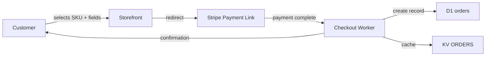
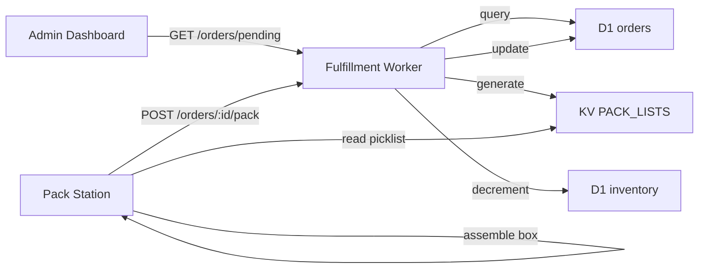
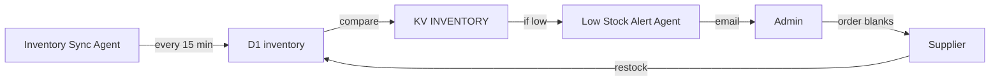

# Box Software Architecture

Monorepo structure and runtime architecture for the NeuNuc Box fulfillment system.

---

## Overview

The box fulfillment monorepo uses pnpm workspaces with a three-tier deployment model:

| Tier | Technology | Deployment Target | Purpose |
|------|-----------|-------------------|---------|
| Presentation | Next.js static export | Cloudflare Pages | Storefront + admin dashboard |
| Processing | Cloudflare Workers | Cloudflare Edge | Checkout + fulfillment logic |
| Persistence | D1 + KV | Cloudflare Edge | Structured data + fast lookups |

## Directory Structure

```
neunuc-box-fulfillment/
├── apps/
│   ├── site/                 # Next.js storefront (Cloudflare Pages)
│   │   ├── pages/
│   │   │   ├── index.tsx         # Landing + hero SKUs
│   │   │   ├── product/[sku].tsx # Product detail
│   │   │   ├── checkout.tsx      # Stripe Payment Link redirect
│   │   │   └── order/[id].tsx    # Order status
│   │   └── components/
│   └── web/                  # Admin dashboard (React SPA)
│       └── pages/
│           └── admin.tsx         # Order queue, inventory, pack list
├── workers/
│   ├── api/                  # Checkout Worker
│   │   └── src/
│   │       └── index.ts        # Stripe webhook handler, order validation
│   └── fulfillment/          # Fulfillment Worker
│       └── src/
│           └── index.ts        # Picklist generation, inventory mgmt
├── packages/
│   ├── core/                 # Shared types, schemas, utilities
│   │   └── src/
│   │       ├── types.ts        # Order, Product, Customer types
│   │       ├── schemas.ts      # D1 table schemas
│   │       └── stripe.ts       # Stripe API helpers
│   └── ui/                   # Shared React components
│       └── src/
│           └── components/   # ProductCard, OrderRow, StatusBadge
├── content/
│   └── boxes/
│       └── registry.json     # 32 SKU definitions + configs
├── scripts/
│   └── build-box.js          # Box Builder: generates PDFs per order
├── infra/
│   └── wrangler.toml          # Worker bindings, D1, KV config
├── package.json
├── pnpm-workspace.yaml
└── README.md
```

## Three Tiers

### Presentation Tier

**Storefront (`apps/site`)**

- Next.js with static export
- Deployed to `a74343ef.neunuc-storefront.pages.dev`
- Pages: landing, product detail, checkout redirect, order status
- Pulls product data from `content/boxes/registry.json` at build time

**Admin Dashboard (`apps/web`)**

- React SPA with Cloudflare Pages
- Deployed to `e0539f3f.neunuc-admin.pages.dev`
- Views: order queue, inventory levels, pack list generation
- Reads from D1 + KV via Cloudflare Pages Functions

### Processing Tier

**Checkout Worker (`workers/api`)**

- Deployed to `neunuc-checkout.helkelx.workers.dev`
- Stripe webhook endpoint: `POST /webhooks/stripe`
- Validates payment, creates D1 order record, sends confirmation
- Environment: `STRIPE_SECRET_KEY`, `STRIPE_WEBHOOK_SECRET`

**Fulfillment Worker (`workers/fulfillment`)**

- Deployed to `neunuc-fulfillment.helkelx.workers.dev`
- Endpoints:
  - `GET /orders/pending` — orders awaiting packing
  - `POST /orders/:id/pack` — mark packed, decrement inventory
  - `POST /orders/:id/ship` — add tracking, trigger notification
  - `GET /inventory` — current bin counts
- Environment: `D1_DATABASE_ID`, `KV_NAMESPACE_ID`

### Persistence Tier

**D1 Database (`neunuc-orders`)**

| Table | Purpose |
|-------|---------|
| `orders` | Order records: id, sku, customer, custom fields, status, timestamps |
| `products` | SKU catalog: id, name, price, description, availability |
| `inventory` | Bin counts: bin_code, item_type, size, color, quantity |
| `customers` | Customer records: id, name, email, shipping address, order history |
| `shipments` | Shipping records: order_id, carrier, tracking_number, status |

**KV Namespaces**

| Namespace | Purpose | TTL |
|-----------|---------|-----|
| `ORDERS` | Order cache by ID | 24 hours |
| `PACK_LISTS` | Generated picklists | Until packed |
| `INVENTORY` | Real-time bin snapshots | 1 hour |
| `CONFIG` | App config, pricing overrides | No TTL |

## Offline Processing

The system includes 6 offline processing agents that run on a schedule or via queue:

| Agent | Trigger | Action |
|-------|---------|--------|
| Inventory Sync | Every 15 min | Reconcile D1 inventory with KV snapshots |
| Order Reminder | Daily 9 AM | Email customers with orders pending more than 3 days |
| Review Request | 7 days post-delivery | Send review link via email |
| Low Stock Alert | Inventory below threshold | Notify admin via email + dashboard flag |
| Daily Summary | Daily 8 PM | Email admin: orders, revenue, pack time avg |
| Abandoned Cart | 1 hour after checkout start | Reminder email (if email captured) |

Agents are implemented as scheduled Cloudflare Workers (cron triggers) or D1 triggers.

## Data Flows

### Customer Places Order



### Packer Processes Order



### Inventory Replenishment



## Build & CI Surface

| Command | Purpose |
|---------|---------|
| `pnpm install` | Install all workspace deps |
| `pnpm --filter site build` | Build storefront static export |
| `pnpm --filter web build` | Build admin dashboard |
| `pnpm --filter api deploy` | Deploy checkout worker |
| `pnpm --filter fulfillment deploy` | Deploy fulfillment worker |
| `node scripts/build-box.js --order 1720893` | Generate print assets for order |

## Environment Variables

| Variable | Set On | Purpose |
|----------|--------|---------|
| `STRIPE_SECRET_KEY` | Checkout Worker | Stripe API authentication |
| `STRIPE_WEBHOOK_SECRET` | Checkout Worker | Validate Stripe webhooks |
| `STRIPE_LINKS` | Storefront | Payment Link URLs per SKU |
| `D1_DATABASE_ID` | Fulfillment Worker | D1 database binding |
| `KV_NAMESPACE_ID` | Fulfillment Worker | KV namespace binding |
| `ADMIN_EMAIL` | Multiple | Notification recipient |
| `SHIPPING_RATE` | Fulfillment Worker | Flat-rate shipping amount |

## Technology Choices

| Decision | Rationale |
|----------|-----------|
| Next.js static export | Fast, SEO-friendly, zero server cost |
| Cloudflare Workers | Edge-deployed, sub-50ms cold start, same account as Pages |
| D1 (SQLite) | Zero-cost at low volume, SQL interface, Cloudflare-native |
| KV | Sub-millisecond reads, perfect for picklists and caching |
| Stripe Payment Links | No checkout code to maintain; instant live payments |
| pnpm workspaces | Shared packages, consistent tooling, monorepo discipline |

## Shared Packages

`packages/core` exports:

- TypeScript interfaces for `Order`, `Product`, `Customer`, `Shipment`
- Zod schemas for runtime validation
- Stripe webhook signature verifier
- D1 query builder (lightweight wrapper)

`packages/ui` exports:

- `ProductCard` — SKU display with price and custom field badges
- `OrderRow` — Admin order queue row with status and actions
- `StatusBadge` — Color-coded order status (monochrome variant)
- `InventoryBar` — Visual bin level indicator

## Monorepo Scripts

Root `package.json` includes:

```json
{
  "scripts": {
    "build:all": "pnpm --filter site build && pnpm --filter web build",
    "deploy:all": "pnpm --filter api deploy && pnpm --filter fulfillment deploy",
    "build:box": "node scripts/build-box.js",
    "sync:inventory": "wrangler d1 execute neunuc-orders --file=./scripts/sync-inventory.sql",
    "lint": "eslint . --ext .ts,.tsx",
    "typecheck": "tsc --noEmit"
  }
}
```
