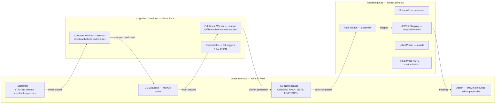
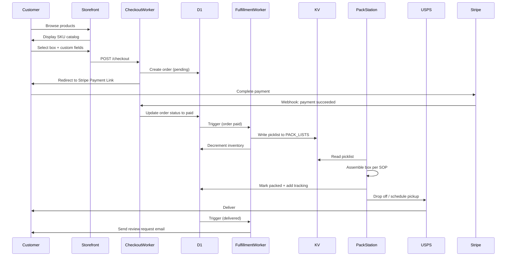

# Box System Architecture

Three-layer cognitive architecture for the NeuNuc Box fulfillment system. Maps vision concepts to deployed code.

---

## Overview

The system is organized into three layers that correspond to how a cognitive model processes reality:

| Layer | Cognitive Analog | System Role | Deployed As |
|-------|-----------------|-------------|-------------|
| State Interface | Perception — what is sensed | What is real in the business | Next.js storefront, admin dashboard, D1 database |
| Cognitive Containers | Cognition — what is reasoned | What interprets, adapts, and orchestrates | Cloudflare Workers (checkout + fulfillment), KV namespaces |
| Grounding Kits | Motor Action — what is executed | What connects to external systems and material reality | Stripe API, USPS shipping, pack station, label printer, heat press |

## Layer 1: State Interface

**Cognitive analog:** Perception — what the system senses about reality.

**Deployed code:**

| Component | Technology | Purpose |
|-----------|------------|---------|
| Storefront | Next.js static export + Cloudflare Pages | Customer-facing product catalog, checkout, order status |
| Admin Dashboard | React SPA + Cloudflare Pages | Internal order management, inventory view, pack queue |
| D1 Database | Cloudflare D1 (SQLite) | Structured data: orders, products, customers, shipping |
| KV Namespaces | Cloudflare KV | Fast lookups: order cache, pack lists, inventory counts |

**What it tracks:**

- 32 box SKUs with configurations, pricing, and availability
- Customer orders with custom fields (name, team, size, color)
- Inventory levels per bin (shirts, hoodies, drinkware, pouches, labels)
- Pack status per order (pending, packed, shipped, delivered)

## Layer 2: Cognitive Containers

**Cognitive analog:** Cognition — what interprets, adapts, and orchestrates.

**Deployed code:**

| Component | Technology | Purpose |
|-----------|------------|---------|
| Checkout Worker | Cloudflare Worker | Stripe payment processing, order validation, fraud check |
| Fulfillment Worker | Cloudflare Worker | Order routing, picklist generation, inventory decrement, ship trigger |
| Orchestrator | D1 triggers + KV events | Connects checkout to fulfillment; triggers notifications |

**What it reasons about:**

- Is inventory sufficient for this order?
- Which bin should the packer pull from?
- Should this order be flagged for rush processing?
- Is the shipping address valid?
- When to send follow-up email for review?

## Layer 3: Grounding Kits

**Cognitive analog:** Motor action — what executes in physical reality.

**Deployed systems:**

| System | Interface | Action |
|--------|-----------|--------|
| Stripe | REST API + webhooks | Charge cards, hold funds, process refunds |
| USPS / Shipping | API or flat-rate labels | Print shipping labels, schedule pickup, track delivery |
| Pack Station | Printed picklist + SOP | Assemble box, customize labels, quality check, seal |
| Label Printer | PDF output from Box Builder | Print name labels, number labels, team labels |
| Heat Press / DTG | Manual + settings sheet | Apply custom text, numbers, or team logos to blanks |

## Map: From Vision to Deployed Code

| Vision Concept | Cognitive Layer | Deployed Component | File |
|----------------|----------------|-------------------|------|
| Customer sees products | State Interface | Storefront page | `apps/site/pages/index.tsx` |
| Customer completes purchase | Cognitive Container | Checkout Worker | `workers/api/src/index.ts` |
| Order is recorded | State Interface | D1 orders table | D1 schema |
| Pack list is generated | Cognitive Container | Fulfillment Worker | `workers/fulfillment/src/index.ts` |
| Packer sees what to pull | State Interface | Admin dashboard | `apps/web/pages/admin.tsx` |
| Labels are printed | Grounding Kit | Box Builder script | `scripts/build-box.js` |
| Box is sealed and shipped | Grounding Kit | Pack station SOP | `sop-pack-station.md` |
| Customer gets tracking | State Interface | Order status page | `apps/site/pages/order/[id].tsx` |

## Data Flow: Order to Shipment

## Integration Points with Core NeuNuc

The Box system runs as a separate product but shares identity and infrastructure patterns with the core NeuNuc monorepo:

| Shared Resource | Core NeuNuc | Box Fulfillment |
|-----------------|-------------|-----------------|
| Domain | `neunuc.com` | `neunuc-storefront.pages.dev` |
| Cloudflare account | Same account | Same account |
| Stripe account | Same business entity | Same business entity |
| Design language | Monochrome, minimal | Extended with product photography |
| Pack station SOP | Not applicable | New, documented here |
