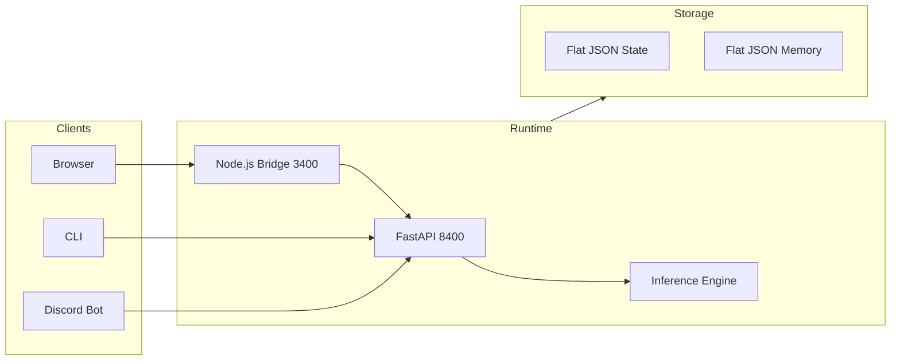

# Capabilities

NeuNuc is a local-first AI operating layer. It runs inference on your hardware, keeps data under your control, and exposes a unified API for building products on top.

---

## What NeuNuc does

### Local inference engine

Run ONNX, llama.cpp, and Ollama backends without sending data to third-party APIs. The runtime boots in under a second and serves models via a FastAPI surface at `127.0.0.1:8400`.

| Backend | Format | Hardware | Use case |
|---------|--------|----------|----------|
| ONNX Runtime | `.onnx` | CPU, DirectML (Windows), CUDA | Production inference, cross-platform |
| llama.cpp | `.gguf` | CPU, GPU (CUDA/Metal) | Research, quantization, edge |
| Ollama | `.gguf` | CPU, GPU | Local experimentation, rapid prototyping |

### Memory and state

Flat JSON storage with no database dependency. State persists across reboots. Memory supports TTL, tagging, and semantic search.

```python
from runtime import store

store.mem_store("user_pref_theme", "dark", ttl=86400, tags=["ui", "preference"])
results = store.mem_search("theme", limit=5)
```

### WebSocket real-time

Broadcast inference results to connected clients in real time. The WebSocket surface uses RFC 6455 frame codec and relays through the Node.js bridge for browser compatibility.

### Operator workspace

A local-only operator surface at `127.0.0.1:5173` for site builders, domain validation, Discord bot drafting, and lead routing. Nothing here touches the internet unless explicitly configured.

### nuc CLI

A single Windows executable that talks to local and remote LLM backends. Package it, distribute it, run it offline.

```powershell
nuc "summarize this contract" --backend=onnx --model=phi-4
```

### Static outreach surfaces

Config-driven HTML sites deploy directly to Cloudflare Pages. No build step. Edit `site-config.json`, swap assets, and ship.

---

## Product stack

NeuNuc powers three product lines:

| Product | What it is | Stack |
|---------|-----------|-------|
| **Box Fulfillment** | Subscription box logistics and Stripe checkout | Next.js, Cloudflare Workers, D1, KV |
| **Voice** | On-device voice assistant with wake word, STT, and TTS | Python, ONNX, Piper |
| **Customer VC** | WebRTC video conferencing with AI moderation | Node.js, WebRTC SFU |

Each product runs independently but shares the NeuNuc runtime for inference, memory, and configuration.

---

## Trust by default

Every integration is opt-in and disabled by default:

- No analytics
- No telemetry
- No payment processing
- No lead capture
- No Discord bot
- No CAPTCHA

Enable only what you need in `neunuc.config.json → trustBoundary`.

---

## Architecture at a glance



See [Architecture](architecture.md) for the full component map.
