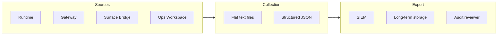

# Audit Trails & Logging

Every action in NeuNuc leaves a trace. Logs are structured, queryable, and exportable. The system is designed to satisfy audit requirements for SOC 2, FedRAMP, and internal compliance programs.

---

## Logging architecture



---

## Log formats

### Runtime logs

```json
{
  "ts": 1716123000.123,
  "level": "info",
  "logger": "neunuc.surface",
  "message": "infer_request",
  "session_id": "sess_abc123",
  "model": "phi-4-onnx",
  "elapsed_ms": 450,
  "client_ip": "127.0.0.1",
  "req_id": "a1b2c3d4e5f6"
}
```

### Gate logs

```json
{
  "ts": 1716123000.456,
  "level": "warning",
  "logger": "neunuc.gate",
  "message": "rate_limited",
  "client_ip": "192.168.1.100",
  "path": "/infer",
  "method": "POST",
  "req_id": "b2c3d4e5f6g7",
  "tokens_remaining": 0
}
```

### Boot logs

```text
[2024-05-19T10:30:00] [INFO] neunuc.boot: phase=1/5 name=hardware_probe
[2024-05-19T10:30:00] [INFO] neunuc.boot: phase=2/5 name=core_init
[2024-05-19T10:30:01] [INFO] neunuc.boot: phase=3/5 name=orchestrator_register
[2024-05-19T10:30:01] [INFO] neunuc.boot: phase=4/5 name=workload_load
[2024-05-19T10:30:02] [INFO] neunuc.boot: phase=5/5 name=surfaces_start
[2024-05-19T10:30:02] [INFO] neunuc.boot: boot_complete elapsed_ms=850
```

---

## Retention policies

| Log type | Default retention | Configurable | Location |
|----------|------------------|--------------|----------|
| Runtime | 30 days | Yes | `logs/neunuc.log` |
| Gate traces | 500 entries in memory | No (circular buffer) | In-memory only |
| Access logs | 90 days | Yes | Cloudflare / nginx |
| Audit events | 7 years | No | Immutable long-term storage |

---

## SIEM integration

### Splunk

Forward logs via HTTP Event Collector:

```python
import requests

requests.post(
    "https://splunk.example.com:8088/services/collector/event",
    headers={"Authorization": "Splunk <token>"},
    json={"event": log_entry}
)
```

### Datadog

Use the Datadog agent with custom log parsing:

```yaml
# /etc/datadog-agent/conf.d/neunuc.d/conf.yaml
logs:
  - type: file
    path: /app/logs/neunuc.log
    service: neunuc
    source: python
```

### ELK Stack

Ship via Filebeat:

```yaml
# filebeat.yml
filebeat.inputs:
  - type: log
    paths:
      - /app/logs/neunuc.log
    json.keys_under_root: true
```

---

## Audit checklist

Use this checklist before compliance reviews:

- [ ] Log levels are set to `info` or higher in production
- [ ] Gate traces are exported to SIEM before buffer rollover
- [ ] Boot logs are preserved for incident reconstruction
- [ ] Custom rules changes are logged with operator identity
- [ ] `trustBoundary` changes are logged as audit events
- [ ] Log files are read-only after rotation
- [ ] Long-term storage is tamper-evident (checksums or append-only)

---

## Compliance reporting

Generate compliance reports from logs:

```python
from runtime import store
import json

# Access events in the last 24 hours
report = {
    "period": "24h",
    "total_requests": gate.recent(n=500),
    "denied_requests": [e for e in gate.recent(n=500) if not e["allowed"]],
    "rate_limited_ips": list(set(e["ip"] for e in gate.recent(n=500) if e["reason"] == "rate_limited"))
}

with open("compliance-report.json", "w") as f:
    json.dump(report, f, indent=2)
```

---

## Immutable audit trail

For environments requiring immutable logs:

```powershell
# Append-only log with checksum
Add-Content -Path logs/audit.log -Value "$((Get-Date -Format o)) | $(Get-FileHash logs/neunuc.log -Algorithm SHA256).Hash"
```

Or use a write-once storage backend (AWS S3 Object Lock, Azure Immutable Blob Storage) for long-term retention.
