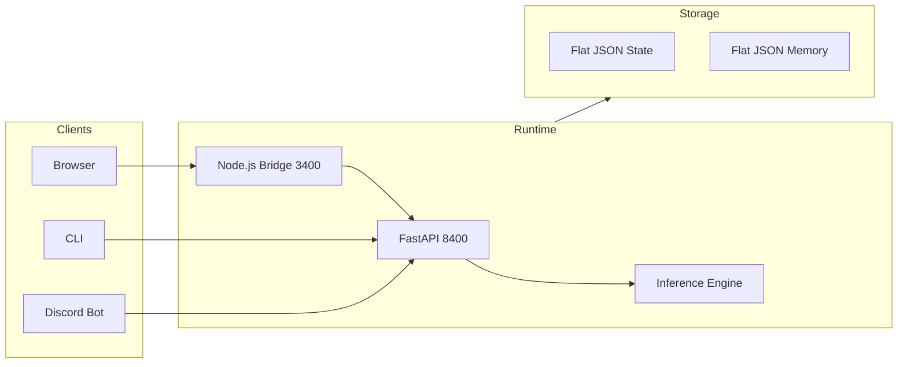

# NeuNuc

## AI infrastructure that stays under your control.

NeuNuc is a local-first operating layer for building and deploying AI products. It runs inference on your hardware, keeps data in your environment, and exposes a unified API for teams that cannot afford to leak.

---

## Why NeuNuc

**Local inference.** Run ONNX, llama.cpp, and Ollama backends without sending prompts to third-party APIs. Your data never leaves your network unless you explicitly configure it.

**Unified stack.** One runtime, one config file, one CLI. Python inference engine. Node.js surface bridge. Flat JSON storage. No database to manage, no Docker swarm to debug.

**Built for operators.** An operator workspace at `127.0.0.1:5173` for site builders, domain validation, and Discord bot drafting. A dashboard for monitoring. A CLI packaged as a single Windows executable.

**Federal-ready posture.** NIST 800-53 aligned. Default-deny trust boundary. Structured audit logs. FedRAMP Moderate path in progress.

---

## Architecture

The runtime is a hybrid Python + Node.js system. Python handles inference, memory, state, and orchestration. Node.js serves HTML surfaces and proxies API calls. Both boot from a single entry point in under a second.

See [Architecture](architecture.md) for the full component map.

---

## Capabilities

| Capability | Description |
|-----------|-------------|
| **Inference** | ONNX, llama.cpp, Ollama backends on CPU or GPU |
| **Memory** | Flat JSON with TTL, tagging, and semantic search |
| **State** | Persistent key-value across reboots |
| **WebSocket** | Real-time broadcast to connected clients |
| **CLI** | Single Windows executable for local and remote backends |
| **Static sites** | Config-driven HTML deployable to Cloudflare Pages |

See [Capabilities](capabilities.md) for the full feature matrix.

---

## Trust

- **Default-deny.** Every integration is opt-in. Analytics, payments, Discord, lead capture — all disabled by default.
- **Request tracing.** Every gate check generates a unique ID. The last 500 decisions are inspectable in memory.
- **Rate limiting.** Token-bucket per client IP. Configurable thresholds before deployment.
- **Audit-ready.** Structured JSON logs. SIEM export. 7-year retention support.

See [Trust & Security](trust-security.md) and [Compliance](compliance-security.md).

---

## Products built on NeuNuc

| Product | What it does |
|---------|-----------|
| **Box Fulfillment** | Subscription box logistics with Stripe checkout and Cloudflare Workers |
| **Voice** | On-device voice assistant with wake word, STT, and TTS |
| **Customer VC** | WebRTC video conferencing with AI moderation |

---

## Get started

[Deploy](getting-started.md) — Install and boot in under 10 minutes.

[Compliance](compliance-security.md) — Security posture, certifications, and procurement readiness.

[Reference](api.md) — API endpoints, models, and configuration schema.

---

*NeuNuc Systems LLC. Built in the United States.*
