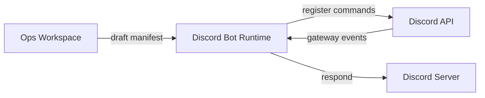

# Discord Bot Operations

Draft, test, and deploy Discord bot manifests from the local ops workspace.

---

## What It Is

The Discord bot runtime lives in `adapters/discord-bot-runtime/`. It is a Node.js / Discord.js application that handles slash commands, event handlers, and gateway connections. The ops workspace provides a manifest drafting interface; the runtime is deployed separately.

## Architecture



## Project Layout

```
adapters/discord-bot-runtime/
├── src/
│   ├── index.ts                  # Entry point
│   ├── commands/                 # Slash command handlers
│   │   └── ping.ts
│   ├── events/                   # Gateway event handlers
│   │   └── ready.ts
│   ├── services/                 # Business logic
│   ├── types/                    # TypeScript definitions
│   └── config.ts                 # Runtime configuration
├── package.json
├── tsconfig.json
└── .env.example                  # Required environment variables
```

## Manifest Drafting

In the ops workspace Discord Control lane:

1. Select bot template from `templates/discord-bot/` or `adapters/discord-bot-runtime/`
2. Edit intents (what events the bot receives)
3. Define slash commands
4. Configure event handlers
5. Export manifest to `dist/bots/<name>/`

### Manifest Format

```json
{
  "name": "neunuc-bot",
  "intents": ["Guilds", "GuildMessages", "MessageContent"],
  "commands": [
    {
      "name": "ping",
      "description": "Check bot latency",
      "options": []
    },
    {
      "name": "status",
      "description": "Check system status",
      "options": []
    }
  ],
  "events": ["ready", "messageCreate", "interactionCreate"]
}
```

## Runtime Configuration

Create `.env` from `.env.example`:

```bash
DISCORD_TOKEN=your_bot_token_here
DISCORD_CLIENT_ID=your_client_id_here
DISCORD_GUILD_ID=your_test_guild_id_here
```

| Variable | Required | Description |
|----------|----------|-------------|
| `DISCORD_TOKEN` | Yes | Bot token from Discord Developer Portal |
| `DISCORD_CLIENT_ID` | Yes | Application client ID |
| `DISCORD_GUILD_ID` | No | Test guild ID for faster command registration |

## Development

```bash
cd adapters/discord-bot-runtime
npm install
npm run dev        # ts-node-dev with hot reload
npm run build      # Compile TypeScript
npm start          # Run compiled output
```

## Command Registration

Register slash commands globally or to a specific guild:

```bash
# Register to test guild (fast, good for dev)
npm run register:guild

# Register globally (takes up to 1 hour to propagate)
npm run register:global
```

## Deployment

The Discord bot runtime is deployed as a standalone Node.js process on a hosting VM:

```bash
cd adapters/discord-bot-runtime
npm run build

# Deploy to server
rsync -avz dist/ user@bot-host:/opt/neunuc-bot/
ssh user@bot-host "cd /opt/neunuc-bot && pm2 restart neunuc-bot"
```

Or use Docker:

```dockerfile
FROM node:20-alpine
WORKDIR /app
COPY package*.json ./
RUN npm ci --only=production
COPY dist/ ./dist/
CMD ["node", "dist/index.js"]
```

## Event Handlers

| Event | Handler | Purpose |
|-------|---------|---------|
| `ready` | `src/events/ready.ts` | Bot startup, presence set |
| `messageCreate` | `src/events/messageCreate.ts` | Respond to non-slash messages |
| `interactionCreate` | `src/events/interactionCreate.ts` | Route slash commands |

## Adding a Command

1. Create `src/commands/<name>.ts`:

```typescript
import { ChatInputCommandInteraction } from 'discord.js';

export const data = {
  name: 'status',
  description: 'Check NeuNuc system status',
};

export async function execute(interaction: ChatInputCommandInteraction) {
  await interaction.reply('All systems operational.');
}
```

2. Register in `src/commands/index.ts`:

```typescript
export * from './ping';
export * from './status';
```

3. Rebuild and restart:

```bash
npm run build
npm run register:global
```

## Safety Boundaries

- Bot token never committed to Git. Lives in `.env` only.
- Test guild ID restricts command registration during development.
- No database writes from the bot without explicit opt-in.
- Rate limit handling is built into Discord.js by default.

## Troubleshooting

| Symptom | Cause | Fix |
|---------|-------|-----|
| Commands not appearing | Not registered | Run `npm run register:global` |
| Gateway disconnect | Invalid token | Verify `DISCORD_TOKEN` in `.env` |
| Commands show "application did not respond" | Handler threw | Check `src/commands/` for uncaught errors |
| TypeScript build fails | Missing types | Run `npm install` |
| Bot offline after deploy | PM2 not running | `pm2 start dist/index.js --name neunuc-bot` |
| Rate limited | Too many API calls | Discord.js handles this automatically; check logs |

## Rollback

If a deployed bot fails:

```bash
ssh user@bot-host
cd /opt/neunuc-bot
git checkout HEAD~1   # or restore previous dist/ backup
npm run build
pm2 restart neunuc-bot
```

Always keep the last working `dist/` directory backed up before deploying.
