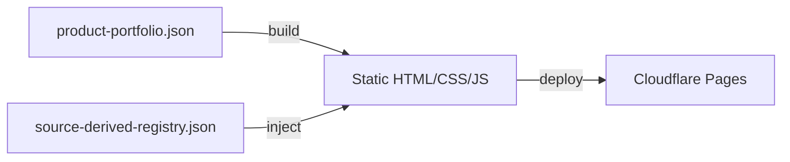

# Public Site Builder

Static site template for outreach, landing, and conversion pages. Zero-framework export. Deploys to Cloudflare Pages.

---

## What It Is

The `public-access` template in `templates/builders/public-access/` is a static HTML/CSS/JS site generator. It reads product data from `config/product-portfolio.json` and outputs a deployable site to `dist/sites/public-access/`.

## Architecture



## Features

| Feature | Implementation |
|---------|----------------|
| Responsive layout | CSS Grid + Flexbox, mobile-first |
| Product cards | JSON-driven, auto-generated from portfolio |
| Pricing tables | Tiered pricing from `product-portfolio.json` |
| Lead capture form | Client-side validation + webhook POST |
| Analytics | Plausible or Cloudflare Web Analytics (opt-in) |
| Turnstile | Cloudflare Turnstile spam protection (opt-in) |
| Stripe embed | Checkout redirect via `stripe-checkout-worker` |

## Build

```bash
cd templates/builders/public-access
npm install
npm run build
```

Output: `dist/sites/public-access/`

## Deploy

```bash
cd templates/builders/public-access
wrangler pages deploy dist
```

Or configure `wrangler.toml` with your Cloudflare account ID and project name, then:

```bash
wrangler pages publish dist --project-name=neunuc-public
```

## Configuration

### Product Data

Edit `config/product-portfolio.json` in the workspace root:

```json
{
  "products": [
    {
      "id": "box-fulfillment",
      "name": "NeuNuc Box Fulfillment",
      "tagline": "Ship smarter. Scale faster.",
      "description": "End-to-end fulfillment for subscription box businesses.",
      "pricing": {
        "starter": {
          "price": 29,
          "period": "month",
          "features": ["Up to 100 boxes/mo", "Basic analytics", "Email support"]
        },
        "pro": {
          "price": 99,
          "period": "month",
          "features": ["Up to 1,000 boxes/mo", "Advanced analytics", "Priority support"]
        }
      }
    }
  ]
}
```

### Site Metadata

Edit `templates/builders/public-access/src/config.js`:

```javascript
export const siteConfig = {
  title: "NeuNuc — Ship Smarter",
  description: "End-to-end fulfillment for modern subscription businesses.",
  url: "https://neunuc.com",
  ogImage: "/assets/og-image.png",
  analytics: {
    provider: "plausible", // or "cloudflare"
    domain: "neunuc.com"
  },
  turnstile: {
    enabled: true,
    siteKey: "0x4AAAA..." // Cloudflare Turnstile site key
  }
};
```

### Stripe Checkout

The lead capture form redirects to the Stripe checkout worker. Configure in `config/product-portfolio.json`:

```json
{
  "stripe": {
    "checkoutWorkerUrl": "https://neunuc-checkout.helkelx.workers.dev",
    "successUrl": "https://neunuc.com/success",
    "cancelUrl": "https://neunuc.com/cancel"
  }
}
```

## File Structure

```
templates/builders/public-access/
├── src/
│   ├── index.html              # Main page template
│   ├── styles/
│   │   └── main.css            # Minimal, responsive CSS
│   ├── scripts/
│   │   └── main.js             # Form handling, analytics init
│   └── config.js               # Site metadata + integrations
├── assets/
│   ├── logo.svg                # NeuNuc wordmark
│   └── og-image.png            # Social share image
├── package.json
├── vite.config.js              # Static export config
└── wrangler.toml               # Cloudflare Pages deploy config
```

## Privacy Limits

The public-access template is designed with privacy-by-default:

- No Google Analytics, no Facebook Pixel, no third-party cookies
- Analytics provider is opt-in (Plausible or Cloudflare, both privacy-first)
- Turnstile is client-side only — no user data stored
- Lead form POSTs to operator-controlled webhook, not a third-party CRM
- No tracking scripts loaded without explicit config

## Customization

### Add a New Product

1. Add product object to `config/product-portfolio.json → products`
2. Add product image to `templates/builders/public-access/assets/`
3. Reference image in product config
4. Rebuild and redeploy

### Change Theme

Edit `src/styles/main.css`. The template uses CSS custom properties:

```css
:root {
  --accent: #4a7a9e;
  --text: #1a1a1a;
  --surface: #f7f8f9;
  --border: #e5e7eb;
}
```

### Add a New Page

1. Create `src/<page>.html`
2. Add route in `vite.config.js → build.rollupOptions.input`
3. Rebuild

## Troubleshooting

| Symptom | Cause | Fix |
|---------|-------|-----|
| Build fails | Missing `product-portfolio.json` | Ensure config file exists at workspace root |
| Product cards empty | Invalid JSON in portfolio | Validate `product-portfolio.json` |
| Styles not loading | CSS import path wrong | Check `src/styles/main.css` import in `index.html` |
| Form not submitting | Webhook URL not configured | Set `webhookUrl` in `config.js` |
| Turnstile not showing | Site key missing | Add Turnstile site key to `config.js` |
| Deploy fails | Wrangler not authenticated | Run `wrangler login` |
