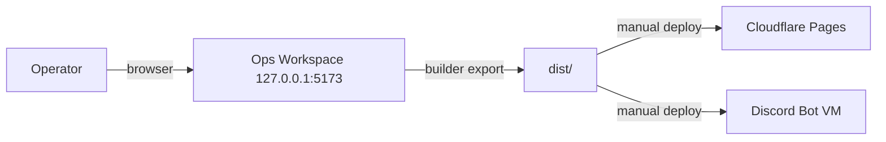

# Ops Workspace

Local-only operator surface at `127.0.0.1:5173`. Draft sites, validate domains, build Discord bots, and manage public surfaces before deployment. Nothing leaves the machine unless explicitly exported.

---

## What It Is

The ops workspace is a Node.js/Vite single-page application. It does not bind to the public network. All data stays local unless an operator triggers a builder export.



## Project Layout

```
neunuc-ops-workspace/
├── config/
│   ├── product-portfolio.json          # Product definitions, pricing, features
│   └── source-derived-registry.json    # Content registry: copy blocks, media assets
├── adapters/
│   ├── discord-bot-runtime/            # Discord.js bot runtime (see Discord Bot docs)
│   └── stripe-checkout-worker/         # Cloudflare Worker for Stripe checkout
├── templates/
│   └── builders/
│       └── public-access/              # Static site builder template (see Public Site docs)
├── shared/
│   ├── components/                     # Reusable UI components
│   ├── services/                       # API wrappers, data services
│   ├── stores/                         # State management
│   ├── utils/                          # Helpers, formatters
│   ├── types/                          # TypeScript type definitions
│   ├── hooks/                          # React hooks
│   ├── constants/                      # Static constants
│   └── styles/                         # Global CSS, themes
├── server.mjs                          # Express entry point
├── index.html                          # Vite root
├── vite.config.ts
├── package.json
└── tsconfig.json
```

## Boot

```powershell
pnpm ops:workspace
```

Runs `node apps/neunuc-ops-workspace/server.mjs`, which starts the Vite dev server bound to `127.0.0.1:5173`.

## Operator Lanes

The workspace is organized into five lanes. Each lane is isolated and operates only within the workspace unless the operator triggers a builder export.

### 1. Site Builders

Draft static outreach sites from templates stored in `templates/builders/`.

- Select template (e.g., `public-access`)
- Edit content via JSON-driven config (`config/product-portfolio.json`)
- Preview locally
- Build to `dist/sites/<name>/`
- Deploy manually to Cloudflare Pages

### 2. Public Domains

Plan and validate domain configurations before DNS cutover.

- Enter domain → check A/AAAA/CNAME records
- Validate SSL readiness
- Output deployment checklist and `CNAME` recommendation

### 3. Content Registry

Manage content snippets, copy blocks, and media assets.

- Stored in `config/source-derived-registry.json`
- Tag content by surface (founder, system, outreach, pricing, therapy)
- Export content bundles to builder pipelines

### 4. Lead Routing

Configure lead capture flows and validation rules.

- Define form fields, validation rules, webhook endpoints
- Test submission locally
- Integrates with CRM webhook defined in `neunuc.config.json`

### 5. Discord Control

Draft and test Discord bot manifests before deployment.

- Select bot template from `templates/discord-bot/` or `adapters/discord-bot-runtime/`
- Edit intents, slash commands, event handlers
- Export to `dist/bots/<name>/` for deployment

## Safety Boundaries

| Rule | Enforcement |
|------|-------------|
| Localhost only | Binds to `127.0.0.1`. No `--host` override in default scripts. |
| No external API calls without config | All integrations require explicit `neunuc.config.json` flags. |
| Builder output is local-first | Build artifacts go to `dist/`. Deployment is a separate manual step. |
| No secrets in workspace storage | Tokens and keys live in `neunuc.config.json` or env vars, never in workspace state. |

## Configuration

The workspace reads from `config/product-portfolio.json` for product data and `config/source-derived-registry.json` for content assets. These are JSON files, not TypeScript, so they can be edited without recompiling.

`product-portfolio.json` schema:

```json
{
  "products": [
    {
      "id": "box-fulfillment",
      "name": "NeuNuc Box Fulfillment",
      "tagline": "Ship smarter. Scale faster.",
      "pricing": {
        "starter": { "price": 29, "period": "month" },
        "pro": { "price": 99, "period": "month" },
        "enterprise": { "price": 299, "period": "month" }
      },
      "features": ["Real-time inventory", "Stripe checkout", "D1 database"]
    }
  ]
}
```

## Deployment Separation

The workspace itself is never deployed. Its outputs are:

| Output | Destination | Method |
|--------|-------------|--------|
| Built sites | `dist/sites/` → Cloudflare Pages | Manual `wrangler deploy` or CI |
| Discord bots | `dist/bots/` → Hosting VM | Manual rsync or CI |
| Checkout worker | `adapters/stripe-checkout-worker/` → Cloudflare Workers | Manual `wrangler deploy` or CI |
| Domain plans | Exported as markdown checklist | Operator decision |

## Troubleshooting

| Symptom | Cause | Fix |
|---------|-------|-----|
| Port 5173 in use | Another Vite instance running | `pnpm ops:workspace -- --port 5174` or kill existing process |
| Builder not appearing | Template path mismatch | Verify `templates/builders/<name>/` exists |
| Template not found | Wrong relative path | Paths resolve from repo root, not workspace root |
| Workspace loads but lanes empty | Build cache stale | `rm -rf node_modules/.vite` and restart |
| Product data not showing | `product-portfolio.json` malformed | Validate JSON syntax |
