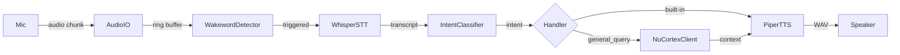

# Voice Pipeline

Local-first voice assistant stack. Zero-cloud audio policy. Runs entirely on-device with ONNX Runtime + DirectML.

---

## What It Does

NeuNuc Voice listens for a wakeword, transcribes speech to text, classifies intent, and responds via neural text-to-speech. All processing happens locally. No audio leaves the machine unless explicitly routed to NuCortex for general knowledge queries.



## Pipeline States

| State | Trigger | Duration |
|-------|---------|----------|
| IDLE | Wakeword detected | Continuous |
| LISTENING | Speech ends (VAD silence 1.2s) | Up to 30s max |
| PROCESSING | Transcription + intent classification | 200 to 800ms |
| RESPONDING | TTS synthesis + playback | 100 to 500ms |

## Architecture

| Component | Technology | Purpose |
|-----------|------------|---------|
| AudioIO | `sounddevice` + ring buffer | Capture, playback, RMS/VAD |
| WakewordDetector | OpenWakeWord (ONNX) | Custom `.onnx` wakeword models |
| WhisperSTT | Whisper ONNX Runtime + DirectML | Speech-to-text |
| IntentClassifier | Phi-class ONNX classifier | Intent + confidence + keyword fallback |
| PiperTTS | Piper neural TTS | Text-to-speech |
| NuCortexClient | WebSocket (`ws://localhost:8765`) | Conversational memory + LLM context |
| Orchestrator | Async state machine | Wires all components together |

## Personality Modes

| Mode | Flag | Behavior |
|------|------|----------|
| Polite | `--polite` | Default. Straightforward, helpful. |
| Sharp | `--sharp` | Sarcastic, dry wit, fact-based, no corporate fluff. Built-in handlers roast the user. |

The sharp mode is the default in production configs. It does not affect NuCortex routing — general queries still go to the LLM with the configured system prompt.

## Project Layout

```
neunuc-voice/
├── config/
│   └── config.yaml              # Central configuration
├── src/neunuc_voice/
│   ├── __main__.py              # CLI entry
│   ├── cli.py                   # Clean CLI
│   ├── gui.py                   # Toga + tkinter GUI
│   ├── api.py                   # FastAPI REST + WebSocket
│   ├── audio.py                 # Ring buffer + I/O
│   ├── wakeword.py              # OpenWakeWord wrapper
│   ├── stt.py                   # Whisper ONNX STT
│   ├── intent.py                # ONNX intent classifier
│   ├── tts.py                   # Piper TTS wrapper
│   ├── nucortex.py              # WebSocket context client
│   └── orchestrator.py          # Async state machine
├── scripts/
│   ├── download_models.py       # Download base ONNX models
│   ├── record_samples.py        # Voice sample recorder
│   ├── train_wakeword.py        # Custom wakeword training
│   ├── train_tts_voice.py       # Piper voice cloning
│   └── quantize_models.py       # INT8 ONNX quantization
├── build/
│   ├── neunuc-voice.spec        # PyInstaller standalone .exe
│   ├── neunuc-voice.iss         # Inno Setup wizard
│   ├── install.bat              # One-click Windows build
│   ├── briefcase.toml           # BeeWare Briefcase config
│   ├── android/README_ANDROID.md
│   └── ios/README_IOS.md
├── PRODUCT.html                 # Product landing page
├── LICENSE.txt
├── README.md
└── pyproject.toml
```

## Run Modes

| Mode | Command | Use |
|------|---------|-----|
| CLI | `python -m neunuc_voice` | Terminal-based, callbacks print to stdout |
| GUI | `python -m neunuc_voice --gui` | Desktop window (Toga or tkinter fallback) |
| API | `python -m neunuc_voice --api --port 8080` | REST + WebSocket server for remote clients |
| Sharp | `python -m neunuc_voice --sharp` | Overrides config personality to sharp mode |

Entry scripts:

```bash
neunuc-voice       # CLI
neunuc-gui         # GUI
neunuc-api         # API server
```

## Model Requirements

| Model | Path | Source |
|-------|------|--------|
| OpenWakeWord | `models/openwakeword/hey_nuc.onnx` | Pretrained or custom trained via `scripts/train_wakeword.py` |
| Whisper ONNX | `models/whisper/whisper-tiny.onnx` | Community ONNX releases |
| Intent | `models/intent/phi-intent.onnx` | Export small Phi/DistilBERT to ONNX |
| Piper Voice | `models/piper/en_US-lessac-medium.onnx` | [rhasspy/piper](https://github.com/rhasspy/piper) voices |

All models are downloaded once and stored locally. The `scripts/download_models.py` helper fetches base pretrained models.

## Hardware Requirements

| Component | Minimum | Recommended |
|-----------|---------|-------------|
| CPU | Any x86_64 with AVX2 | Intel Core i5 / AMD Ryzen 5 |
| RAM | 4 GB | 8 GB |
| GPU | Optional | DirectML-compatible GPU for Whisper |
| Microphone | Any USB mic | Noise-canceling headset |
| Storage | 500 MB | 2 GB (multiple voice models) |

## Known Limitations

1. Whisper tokenizer in `stt.py` uses a simplified greedy decode stub. For production text output, swap in a real ONNX tokenizer.
2. Model downloads are manual. No auto-download on first run.
3. Mobile scaffolding (Android/iOS via BeeWare Briefcase) is documented but not yet built.
4. Installer icons (`assets/icon.ico`, `assets/icon.png`) are not yet created.
5. PyInstaller + Inno Setup builds are ready as templates but not yet executed.
