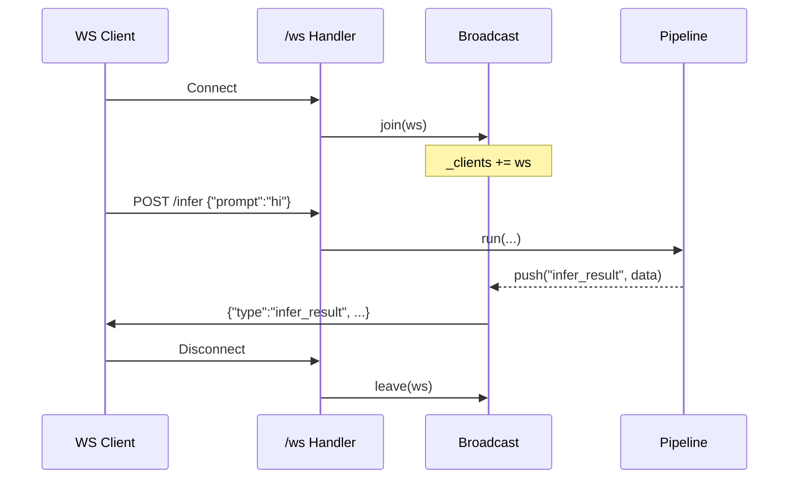

# WebSocket & Real-time
The runtime exposes a single WebSocket endpoint at `/ws`. It is a **fire-and-forget broadcast channel**: clients connect, listen, and inference results are pushed to all connected clients via `broadcast.push()`.

---

## Protocol

### Connection

```javascript
const ws = new WebSocket("ws://localhost:8000/ws");

ws.onopen = () => console.log("connected");
ws.onmessage = (e) => {
    const msg = JSON.parse(e.data);
    console.log(msg.type, msg.data);
};
ws.onclose = () => console.log("disconnected");
```

### Message Format

Every broadcast message is JSON with three fields:

```json
{
    "type": "infer_result",
    "ts": 1716123456.789,
    "data": { ... }
}
```

| Field | Type | Description |
|-------|------|-------------|
| `type` | `str` | Event kind (`infer_result`, `status`, etc.) |
| `ts` | `float` | Unix timestamp (seconds, float) |
| `data` | `dict` | Payload specific to the event type |

---

## Broadcast (`runtime/broadcast.py`)

### Client Lifecycle

`runtime/surface.py` manages WebSocket connections and delegates to `runtime/broadcast.py`:

```python
# When a client connects
broadcast.join(ws)

# When a client disconnects
broadcast.leave(ws)
```

### Pushing Messages

Inference results and other events are broadcast to **all** connected clients:

```javascript
from runtime import broadcast

sent = await broadcast.push("infer_result", {"output": "hello", "model": "phi"})
print(f"Reached {sent} clients")
```

### Client Count

```python
n = broadcast.client_count()  # number of currently connected WS clients
```

### History

The last 100 broadcast events are kept in memory for inspection:

```python
recent = broadcast.history(n=20)  # last 20 events
```

Each history entry:

```json
{
    "type": "infer_result",
    "ts": 1716123456.789,
    "data": { ... }
}
```

---

## Event Types

| Type | Source | Data Shape | Description |
|------|--------|------------|-------------|
| `infer_result` | `/infer`, `/infer/stream` | `{"output", "model", "elapsed_ms", "session_id"}` | Inference completion |
| `status` | Boot / health check | `{"phase", "message"}` | Runtime status updates |

You can add custom event types by calling `broadcast.push()` from any module.

---

## Typical Client Code

=== "JavaScript (Browser)"

    ```javascript
    const ws = new WebSocket("ws://localhost:8000/ws");
    const messages = [];

    ws.onmessage = (event) => {
        const msg = JSON.parse(event.data);
        if (msg.type === "infer_result") {
            messages.push(msg.data);
            console.log("New result:", msg.data.output);
        }
    };
    ```

=== "Python (websockets)"

    ```python
    import asyncio, json, websockets

    async def listen():
        async with websockets.connect("ws://localhost:8000/ws") as ws:
            async for raw in ws:
                msg = json.loads(raw)
                if msg["type"] == "infer_result":
                    print("Result:", msg["data"]["output"])

    asyncio.run(listen())
    ```

---

## Architecture Diagram



---

## Scaling Notes

- Broadcast keeps **all** active sockets in a single `set()`.
- Each `push()` fans out to every client concurrently using `asyncio.gather`.
- Dead sockets are pruned automatically after send failure.
- For >1,000 concurrent WS clients, consider:
  - Using an external pub/sub (Redis, NATS)
  - Sharding by room/topic
  - Replacing in-memory `_clients` with a Redis-backed registry
